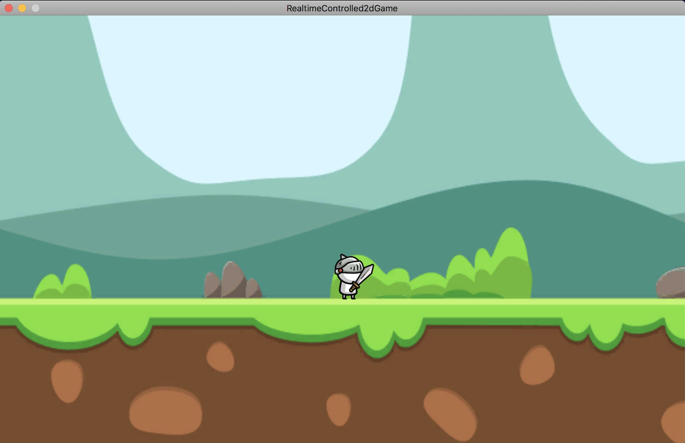
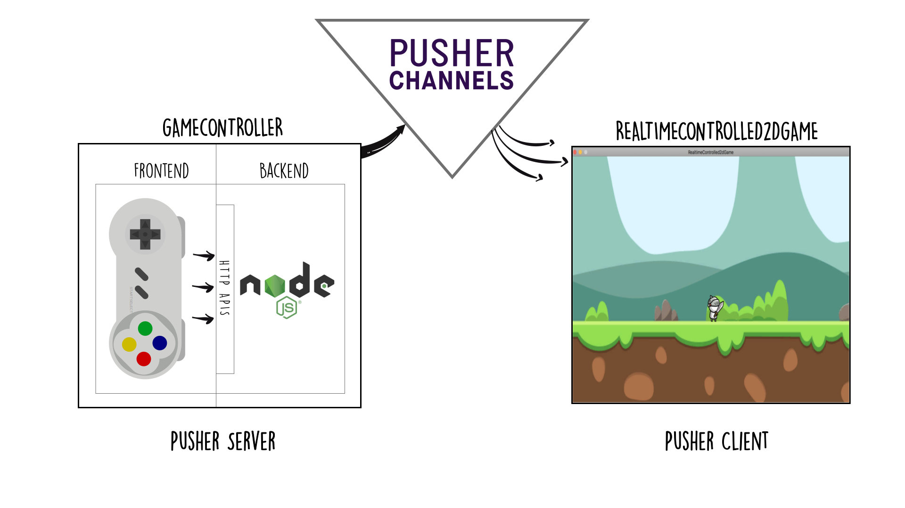

# 1 - realtime controlled 2d game
An example 2d game to show how Pusher Channels can be integrated with Unity

  </img>

### Project Directories
- `RealtimeControlled2dGame` the Unity project that includes a Pusher Channels client (via [pusher-websocket-dotnet](https://github.com/pusher/pusher-websocket-dotnet))
- `GameController` an HTML/CSS/Javascript controller that includes a Pusher Channels server (via [pusher-http-node](https://github.com/pusher/pusher-http-node)) to publish events to the Pusher Channels API

### Project Architecture

  </img>

### Installation and Usage
- 0 - Clone or download this repository `git clone https://github.com/pusher/pusher-channels-unity-examples.git`
- 1 - Create a Pusher Channels app at <https://pusher.com/channels>. In the *"Create your Channels app"* prompt pick .NET as frontend and Node.js as backend
- 2 - Ensure to have **Unity.2018.1.0** installed
- 3 - Ensure to have **Node.js 8 or greater** installed
- 4 - Move to the cloned directory `cd pusher-channels-unity-examples`
- 5 - Move into the GameController dir `cd GameController/` and run `npm install`
- 6 - Edit the `index.js` file under `GameController/` by replacing  `APP_ID`, `APP_KEY`, `APP_SECRET` and `APP_CLUSTER` with the ones that you can find in the  Pusher Channels dashboard's *Getting Started* tab of the newly created app.
- 7 - From inside the GameController directory start the controller app with the command: `npm start`
- 8 - In your Unity 2018.1.0 go to Project, click on Open and select the `RealtimeControlled2dGame` folder
- 9 - In Unity open the `PusherManager.cs` file under the `Assets` folder and replace `APP_KEY` and `APP_CLUSTER` as you did above
- 10 - In Unity in the the `Assets` folder open the `Scenes` folder and double click on the scene named `Level0`. A scene with a knight should show.
- 11 - Click Play to start the game in Unity
- 12 - Go to http://localhost:5000 and click the **left/right arrow keys** or the **B button** to attack
- 13 - You should now be able to see the character moving in the Unity Game tab :tada:

### Credits
- Swordman Asset: [Black Hammer](https://assetstore.unity.com/publishers/32893) https://assetstore.unity.com/packages/2d/characters/2d-simple-character-swordman-133259
- Game Controller: [alvaromontoro](https://codepen.io/alvaromontoro) https://codepen.io/alvaromontoro/pen/bGbpmvR
- Retro Game Sound: Audio Preview from https://audiojungle.net/item/retro-game/21465199 
- Swoosh Game Sound: Sound Effect from http://soundbible.com/706-Swoosh-3.html
- Background: From https://swapnilrane24.itch.io/green-background?download
